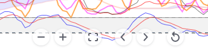

# RemoveTradingviewMouseNavigation
 Removes the buggy mouse navigation panel from the bottom of Tradingview panels to prevent them obscuring charts and indicators.
 
Please see the header in TradingviewRemoveMouseNavigation.js for instructions.

By doing so you accept that there is absolutely no warranty, and you take
responsibility for any issues arising from its use.

